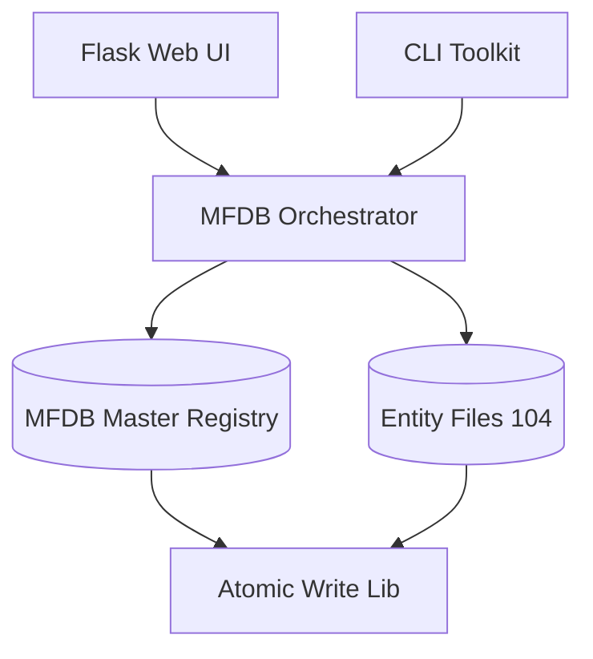

# BEJSON_CMS [Agent-Ready] [llms.txt: Verified]
> Authoritative administrative layer for the MFDB-federated ecosystem.

BEJSON_CMS is a high-density project management and content delivery platform built on the **MFDB v1.31** specification. It provides a unified interface for managing relational data across multiple BEJSON 104 files with atomic integrity and machine-readable precision.

## 🚀 One-Liner
```bash
python3 src/cms-manage.py mount && python3 src/web/Flask_CMS.py
```

## 🏗️ Architecture


## 🛠️ Tech Stack
- **Backend**: Python 3.10+, Flask
- **Database**: MFDB (BEJSON 104 / 104a)
- **UI**: Standardized HTML3 / BECSS
- **Dependencies**: BeautifulSoup4, Pillow, Werkzeug

## 📂 Project Structure
- `src/cli/`: Granular record manipulation tools.
- `src/lib/`: Core BEJSON and MFDB logic engines.
- `src/web/`: Flask application and web controllers.
- `storage/`: Encrypted/Versioned data archives.

## 📄 Documentation
- [AGENTS.md](./AGENTS.MD): Strict constraints for autonomous agents.
- [SYSTEM_MANUAL.md](./SYSTEM_MANUAL.md): Comprehensive technical reference.
- [TODO.md](./docs/TODO.md): Roadmap and pending features.

---
*Author: Elton Boehnen*
*Contact: boehnenelton2024@gmail.com*
