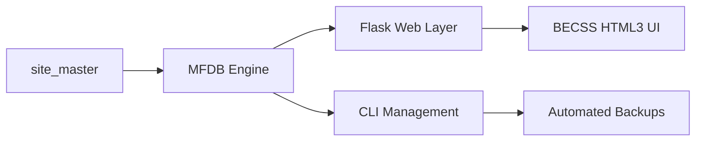

# BEJSON Content Management System (BEJSON_CMS)
> High-Density Static Site & Application Engine powered by MFDB.

  

## Mission
BEJSON_CMS is a high-performance content management system designed for the 2026 Agentic Web. It utilizes Multi-File Databases (MFDB) to decouple content from logic, enabling rapid deployment of mobile-responsive, BECSS-compliant interfaces.

## Visual Architecture


## Quick Start
```bash
# Launch the CMS development server
python3 src/web/Flask_CMS.py
```

## Core Components
- **MFDB Site Master**: Authoritative registry of categories, authors, and pages.
- **BECSS Rendering**: Auto-transformation of BEJSON records into OKLCH-styled HTML3 components.
- **Agentic Publisher**: Integrated pipeline for AI-generated content synchronization.

## Documentation
- [AGENTS.md](./AGENTS.md) — Operational constraints.
- [SYSTEM_MANUAL.md](./SYSTEM_MANUAL.md) — Deep technical specification.

---
**Elton Boehnen** · eltonboehnen@gmail.com · [github.com/boehnenelton](https://github.com/boehnenelton)
