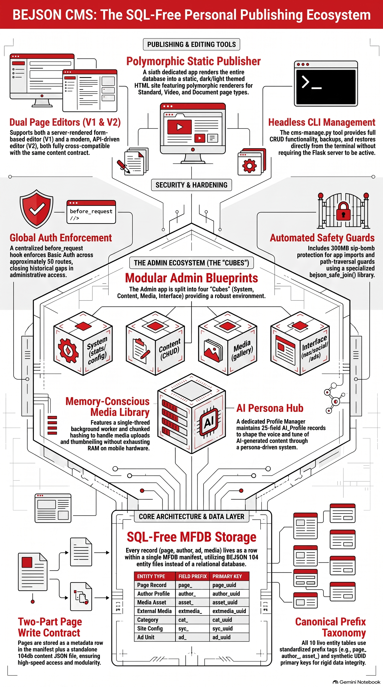

# BEJSON CMS

**Author:** Elton Boehnen  
**Contact:** boehnenelton2024@gmail.com | [boehnenelton2024.pages.dev](https://boehnenelton2024.pages.dev) | [github.com/boehnenelton](https://github.com/boehnenelton)  
**License:** PolyForm Noncommercial 1.0.0  
**Version:** V18.28  

---



## Executive Summary

**BEJSON CMS** is a lightweight, high-performance, self-hosted Content Management System and Static Site Generator engineered to operate entirely without traditional SQL or NoSQL database servers. Every piece of site data—articles, categories, author profiles, media asset metadata, external media embeds, advertisement zones, navigation hierarchies, site settings, social links, and embedded web applications—is persisted as positional matrix records inside **BEJSON** (Binary/Structured JSON) entity files governed by a master **MFDB** (Multi-File Database) manifest (`storage/mfdb/site_master/104a.mfdb.bejson`).

Designed with resource-constrained Android devices (Termux, Pydroid 3) and modern Linux/Unix servers in mind, BEJSON CMS provides a complete publishing pipeline:
- A modular Blueprint-driven Administration Web Suite (`BEJSON_CMS_Admin.py`).
- Dual Content Editors (Classic V1 Code Editor & Next-Gen V2 API-Driven Editor).
- An AI Persona Hub (`BEJSON_CMS_ProfileManager.py`) and Gemini AI Integration (`lib_cms_persona_writer.py`).
- A Headless CLI Management Toolkit (`src/cms-manage.py`).
- A Media Library featuring hash-deduplicated uploads, serial background thumbnailing, and YouTube/PDF embedding.
- A Static Site Publisher (`BEJSON_CMS_Publisher.py`) utilizing polymorphic strategy renderers to output fast, zero-dependency, static websites ready for Cloudflare Pages or traditional web hosts.

---

## Key Features & Highlights

- **Zero-SQL Matrix Storage Architecture**: Data is stored in human-readable, deterministic positional JSON files formatted according to the BEJSON 104, 104a, and 104db specifications.
- **Micro-Memory Footprint & Single-Service Isolation**: Native single-process launcher scripts (`cms_launcher.sh`) ensure low RAM utilization on mobile environments by terminating inactive CMS components before spawning new ones.
- **Canonical Taxonomy & Schema Safeguards**: Standardized entity prefixes (`page_`, `cat_`, `author_`, `asset_`, `extmedia_`, `ad_`, `app_`, `nav_`, `sys_`, `social_`) with automated structural validation and strict path traversal protection (`lib_bejson_Core_bejson_path_guard.py`).
- **Polymorphic Page Rendering Engine**: Extensible rendering architecture (`BEJSON_CMS_Renderers.py`) supporting Standard HTML pages, Video-centric posts with automatic YouTube responsive embedding, and Document/PDF viewports.
- **Hash-Deduplicated Media Pipeline**: File upload pipeline utilizing chunked SHA-256 hashing to eliminate duplicate asset storage, paired with an asynchronous background worker queue (`_asset_process_queue`) for low-peak-memory thumbnail generation.
- **Standalone Web Application Container**: Capability to ingest, extract, and serve self-contained HTML/JS applications directly within the CMS structure.
- **Integrated Security & Authentication**: HTTP Basic Authentication across all Flask applications (`CMS_PASSWORD`), input escaping, and atomic JSON file replacement patterns.

---

## Architectural Paradigm

### BEJSON Data Matrix Specifications

Traditional JSON structures rely on repeated key-value pairs per object, generating significant overhead when scaling. BEJSON decouples schema field declarations from record rows, presenting data as a field definition list followed by positional value arrays:

1. **BEJSON 104 (Flat Table Spec)**: Used for single entity lists where each record is a simple flat array corresponding index-by-index to the declared `Fields` array.
2. **BEJSON 104a (Manifest & Config Spec)**: Restricts field types to scalar primitives (`string`, `integer`, `number`, `boolean`), utilized for the core site manifest (`104a.mfdb.bejson`).
3. **BEJSON 104db (Hierarchical Document Spec)**: Extends matrix storage with relational and parent-child record attributes (`Record_Type`, `Record_Type_Parent`, `Record_UUID`), used for rich page content documents (`storage/mfdb/pages_db/{page_uuid}.json`).

#### Sample Flat Table (`category.bejson`)
```json
{
  "Format": "BEJSON",
  "Format_Version": "104a",
  "Format_Creator": "Elton Boehnen",
  "Records_Type": "Category",
  "Fields": [
    {"name": "cat_name", "type": "string"},
    {"name": "cat_slug", "type": "string"}
  ],
  "Values": [
    ["BEJSON", "bejson"],
    ["Uncategorized", "uncategorized"]
  ]
}
```

### Multi-File Database (MFDB) Engine

The MFDB system (`lib_bejson_Core_mfdb_core.py`) links independent entity BEJSON files through a central manifest document. The manifest tracks entity schemas, relative file paths, primary key field declarations, record counts, and optional audit logs via a Meta-GUID event logger.

```
storage/mfdb/site_master/
├── 104a.mfdb.bejson                  # Central Manifest
└── data/                             # Live Data Matrix Entity Files
    ├── adunit.bejson                 # Advertisement units
    ├── authorprofile.bejson           # Live site authors
    ├── category.bejson               # Content categories
    ├── externalmedia.bejson          # External links & YouTube videos
    ├── mediaasset.bejson             # Local file metadata
    ├── navlink.bejson                # Site navigation links
    ├── pagerecord.bejson             # Master index of page metadata
    ├── siteconfig.bejson             # Key-value site settings
    ├── sociallink.bejson             # Social network links
    └── standaloneapp.bejson          # Standalone web applications
```

---

## Canonical Entity Taxonomy

BEJSON CMS strictly enforces canonical taxonomy field names across all database tables, CLI commands, web apps, and static site renderers.

| Entity | Primary Key | Canonical Fields | Description |
| :--- | :--- | :--- | :--- |
| **PageRecord** | `page_uuid` | `page_uuid`, `page_title`, `page_slug`, `page_cat_name`, `page_type`, `page_created_at`, `page_external_url`, `page_author_name`, `page_featured_img`, `page_template_key`, `page_featured_video_url` | Master registry of all published articles, posts, and external links. |
| **Category** | `cat_name` | `cat_name`, `cat_slug` | Content categorization and menu grouping. |
| **AuthorProfile** | `author_display_name` | `author_display_name`, `author_bio`, `author_avatar_url` | Public author biographic information displayed on articles. |
| **MediaAsset** | `asset_filename` | `asset_filename`, `asset_original_name`, `asset_file_hash`, `asset_file_size`, `asset_mime_type`, `asset_uploaded_at` | Physical local files uploaded to `storage/mfdb/assets/`. |
| **ExternalMedia** | `extmedia_uuid` | `extmedia_uuid`, `extmedia_name`, `extmedia_type`, `extmedia_url`, `extmedia_created_at` | External media embeds, YouTube video links, and remote PDFs. |
| **AdUnit** | `ad_uuid` | `ad_uuid`, `ad_name`, `ad_banner_url`, `ad_target_url`, `ad_zone`, `ad_active` | Banner advertisements rendered in sidebar or inline ad zones. |
| **StandaloneApp** | `app_uuid` | `app_uuid`, `app_name`, `app_slug`, `app_description`, `app_entry_file`, `app_featured_img` | Hosted HTML/JS web applications extracted to `storage/mfdb/standalone_apps/`. |
| **NavLink** | `nav_display_label` | `nav_display_label`, `nav_target_url` | Primary header menu links. |
| **SiteConfig** | `sys_key` | `sys_key`, `sys_value` | Global site configuration (e.g. `title`, `base_url`, `author`, `theme`). |
| **SocialLink** | `social_platform_name` | `social_platform_name`, `social_target_url` | Live site header/footer social channel links. |

---

## System Architecture & Web Applications

BEJSON CMS comprises five modular Flask services operating on configurable dedicated ports, communicating via the shared MFDB database and file storage directory.

```
                             ┌────────────────────────┐
                             │   Admin Suite (:5001)  │
                             │ (Blueprints: Content,  │
                             │  Media, Interface, Sys)│
                             └───────────┬────────────┘
                                         │
 ┌────────────────────────┐              │              ┌────────────────────────┐
 │   Editor V1 (:5003)    ├──────────────┼──────────────┤   Editor V2 (:5004)    │
 │  (Classic Code View)   │              │              │ (API-Driven Modern UI) │
 └────────────────────────┘              │              └────────────────────────┘
                                         │
 ┌────────────────────────┐              │              ┌────────────────────────┐
 │  Persona Hub (:5005)   ├──────────────┼──────────────┤  Publisher App (:5002) │
 │ (AI Profile Management)│              │              │ (Static HTML Exporter) │
 └────────────────────────┘              │              └────────────────────────┘
                                         │
                                 ┌───────▼────────┐
                                 │ Live MFDB Data │
                                 │ & Page Content │
                                 └────────────────┘
```

### 1. Admin Suite (`src/web/BEJSON_CMS_Admin.py`) — Port 5001
The core administrative interface registered via four specialized Flask Blueprints:
- **System Blueprint** (`BEJSON_CMS_System.py`): Database initialization, schema migrations, brand assets seeding, and system factory reset.
- **Content Blueprint** (`BEJSON_CMS_Content.py`): Page management, HTML/ZIP bulk content import wizard, standalone application deployment, and author profile maintenance.
- **Media Blueprint** (`BEJSON_CMS_Media.py`): Paginated gallery view, YouTube video/link manager, bulk asset operations, image lightbox, asset replacement, and hash deduplication.
- **Interface Blueprint** (`BEJSON_CMS_Interface.py`): Navigation menu configuration, social link management, ad unit placements, site settings editor, and static publish triggers.

### 2. Page Editor V1 (`src/web/BEJSON_CMS_PageEditor.py`) — Port 5003
A focused, single-page code editor designed for rapid HTML content editing. Features live side-by-side previewing, direct snippet insertion for YouTube embeds and PDF viewports, category/author selection, and atomic page JSON serialization.

### 3. Page Editor V2 (`src/web/BEJSON_CMS_PageEditorV2.py`) — Port 5004
An advanced, API-driven editor providing a modern workspace interface. Integrates an AI Tasking Hub, persona-guided content generation, structured template selection, responsive preview modes, and a dedicated featured video selector.

### 4. AI Persona Hub (`src/web/BEJSON_CMS_ProfileManager.py`) — Port 5005
Maintains `AI_Profile` records stored as BEJSON entities (`resources/profiles/`). These records encapsulate system instructions, personas, and style guides that dictate AI generation behavior in Page Editor V2, cleanly isolated from public site author profiles.

### 5. Static Publisher (`src/web/BEJSON_CMS_Publisher.py`) — Port 5002
Compiles the complete MFDB database and page content files into clean, static HTML, CSS, and JS output stored in `storage/builds/`. Utilizes strategy renderers (`BEJSON_CMS_Renderers.py`) to generate:
- Homepage and category feeds.
- Article pages with dark/light theme support.
- Standalone application card listings.
- Ad placement integration.
- `sitemap.xml` for search engine indexing.
- Direct Cloudflare Pages deployment integration.

---

## Core Libraries Directory (`src/lib/`)

All underlying business logic and database drivers reside in `src/lib/`:

- **`lib_bejson_Core_bejson_core.py`**: Fundamental BEJSON reader/writer engine, handling field map resolution, positional record access, and value type verification. Exports `RELEASE_VERSION = 300`.
- **`lib_bejson_Core_bejson_path_guard.py`**: Safe path resolution and directory boundary validation (`bejson_safe_join()`, `safe_extract_zip()`). Prevents path traversal vulnerabilities and sibling-directory bypass exploits.
- **`lib_bejson_Core_bejson_validator.py`**: Structural and value-level integrity checker verifying compliance against 104, 104a, and 104db specifications. Enforces canonical type checking (`VALID_FIELD_TYPES`).
- **`lib_bejson_Core_bejson_env.py`**: Resolves system environment variables and path place-holders (`{INTERNAL_STORAGE}`).
- **`lib_bejson_Core_bejson_errors.py`**: Standardized system error codes and exception definitions.
- **`lib_bejson_Core_mfdb_core.py`**: Master MFDB orchestrator class (`MFDBCore`) managing entity creation, manifest synchronization, and operation logging.
- **`lib_bejson_Core_mfdb_validator.py`**: Dataset and manifest validation suite checking cross-entity integrity and field consistency.
- **`lib_bejson_CMS_cms_core.py`**: High-level `CMSCore` interface encapsulating high-frequency database operations with file locking (`ResilientPIDLock`).
- **`lib_bejson_CMS_cms_config.py`**: Global CMS settings and default parameters.
- **`lib_bejson_CMS_cms_mfdb.py`**: Database management helper routines and string slugification (`bejson_utility_slugify`).
- **`lib_bejson_CMS_cms_ports.py`**: Dynamic port resolution helper reading `config.json` and environment variable overrides.
- **`lib_cms_persona_writer.py`**: AI content generation pipeline interacting with Google Gemini models.

---

## Command-Line Management Toolkit (`src/cms-manage.py`)

BEJSON CMS includes a headless command-line toolkit (`src/cms-manage.py`) enabling total administrative control without launching a Flask server.

### Available Command Categories

```bash
python3 src/cms-manage.py <command> [options]
```

#### Status & Diagnostics
```bash
# Check database connection, mount status, and manifest state
python3 src/cms-manage.py status
```

#### Content & Page Management
```bash
# List all pages
python3 src/cms-manage.py page list

# Add a new page
python3 src/cms-manage.py page add "Getting Started with BEJSON" \
    --category "BEJSON" \
    --author "Elton Boehnen" \
    --type "blog" \
    --body "<h1>Hello World</h1><p>Welcome to BEJSON CMS.</p>" \
    --featured-video "https://www.youtube.com/watch?v=dQw4w9WgXcQ"

# Update an existing page by UUID
python3 src/cms-manage.py page update <PAGE_UUID> "Updated Title" \
    --category "Tutorials" \
    --body "<p>Updated body content.</p>"

# Delete a page by UUID
python3 src/cms-manage.py page delete <PAGE_UUID>

# Import an HTML file as a new page
python3 src/cms-manage.py page import --html body.html \
    --title "Imported Page" \
    --category "BEJSON" \
    --author "Elton Boehnen"
```

#### Categories & Authors
```bash
# Category operations
python3 src/cms-manage.py category list
python3 src/cms-manage.py category add "Tutorials" --slug "tutorials"
python3 src/cms-manage.py category delete "Tutorials"

# Author Profile operations
python3 src/cms-manage.py author list
python3 src/cms-manage.py author add "Elton Boehnen" \
    --bio "System Developer" \
    --avatar "/assets/elton.jpg"
python3 src/cms-manage.py author delete "Elton Boehnen"
```

#### Media & External Links
```bash
# Media Asset operations
python3 src/cms-manage.py asset list
python3 src/cms-manage.py asset add /path/to/image.png
python3 src/cms-manage.py asset delete image.png

# External Media & YouTube links
python3 src/cms-manage.py asset list-external
python3 src/cms-manage.py asset add-external "Intro Video" "https://www.youtube.com/watch?v=dQw4w9WgXcQ" --type "video"
python3 src/cms-manage.py asset delete-external <EXTMEDIA_UUID>
```

#### Site Configuration & Navigation
```bash
# Site Config management
python3 src/cms-manage.py config list
python3 src/cms-manage.py config set title "BEJSON Official Site"
python3 src/cms-manage.py config set base_url "https://bejson.org"
python3 src/cms-manage.py config delete title

# Navigation links
python3 src/cms-manage.py navlink list
python3 src/cms-manage.py navlink add "Home" "/"
python3 src/cms-manage.py navlink delete "Home"
```

#### Standalone Applications & Ads
```bash
# Standalone App management
python3 src/cms-manage.py app list
python3 src/cms-manage.py app add "Widget App" --desc "A custom widget" --entry "index.html"
python3 src/cms-manage.py app delete <APP_UUID>

# Advertisement Units
python3 src/cms-manage.py ad list
python3 src/cms-manage.py ad add "Sidebar Ad" "https://example.com/banner.jpg" "https://example.com" --zone "sidebar"
python3 src/cms-manage.py ad delete <AD_UUID>
```

#### Headless Foreground Service Launcher
```bash
# Launch individual service directly from CLI
python3 src/cms-manage.py serve admin
```

---

## Installation & Environment Setup

### System Prerequisites
- **Python**: Version 3.10 or higher.
- **Dependencies**: Minimal footprint requiring only `flask` (and optionally `requests` for AI generation feature sets).

```bash
# Installation on Linux / Android Termux / Pydroid 3
pip install flask --break-system-packages

# Optional: Install requests for AI features and pytest for test suite execution
pip install requests pytest --break-system-packages
```

### Environment Variables & Configuration

Configuration settings can be defined in `config.json` at the project root or overridden using system environment variables:

| Environment Variable | Default | Description |
| :--- | :--- | :--- |
| `CMS_PASSWORD` | `changeme` | Authentication password for all CMS administrative web apps. |
| `CMS_SECRET_KEY` | *Random Generated* | Flask session signing key. Set fixed string in production. |
| `CMS_ADMIN_PORT` | `5001` | Port allocated for `BEJSON_CMS_Admin.py`. |
| `CMS_PUBLISHER_PORT` | `5002` | Port allocated for `BEJSON_CMS_Publisher.py`. |
| `CMS_PAGEEDITOR_PORT` | `5003` | Port allocated for `BEJSON_CMS_PageEditor.py` (V1). |
| `CMS_PAGEEDITORV2_PORT` | `5004` | Port allocated for `BEJSON_CMS_PageEditorV2.py` (V2). |
| `CMS_PROFILES_PORT` | `5005` | Port allocated for `BEJSON_CMS_ProfileManager.py`. |

---

## Service Management & Process Launchers

BEJSON CMS provides three distinct service launching mechanisms tailored to different operating environments:

### 1. Pydroid 3 / Mobile Quick Start (`pydroid_start.py`)
Optimized for one-tap execution in mobile Python environments on Android devices:
```bash
python3 pydroid_start.py
```
Launches the main Admin Suite on `http://127.0.0.1:5001`.

### 2. Single-Service Isolated Launcher (`cms_launcher.sh`)
Designed for low-memory Android Termux environments. Automatically terminates any previously running CMS process before starting the selected target service:
```bash
./cms_launcher.sh admin       # BEJSON_CMS_Admin.py          :5001
./cms_launcher.sh publisher   # BEJSON_CMS_Publisher.py      :5002
./cms_launcher.sh editor      # BEJSON_CMS_PageEditor.py     :5003
./cms_launcher.sh editorv2    # BEJSON_CMS_PageEditorV2.py   :5004
./cms_launcher.sh profiles    # BEJSON_CMS_ProfileManager.py :5005
```

### 3. Advanced Multi-Service Supervisor (`advanced_launcher.py`)
A process supervisor for desktop/server platforms capable of running and monitoring all web services concurrently:
```bash
python3 advanced_launcher.py
```

---

## Directory Structure & Complete File Map

```
BEJSON_CMS/
├── .bejson_project.json             # Project registration & changelog history tracker
├── .gitignore                        # Git exclusion rules
├── AGENTS.md                        # Developer AI agent policy & operating guidelines
├── CHANGELOG.md                     # Comprehensive revision history log
├── LICENSE                          # PolyForm Noncommercial 1.0.0 license terms
├── README.md                        # Master project documentation (this file)
├── SECURITY.md                      # Security model & vulnerability reporting policy
├── advanced_launcher.py             # Multi-service process supervisor
├── cms_launcher.sh                  # Single-service process isolation shell script
├── generate_taxonomy_report.py      # Database taxonomy audit script
├── pydroid_start.py                 # Pydroid 3 Android start script
│
├── docs/                            # Technical Documentation Set
│   ├── architecture.md              # System architecture deep-dive
│   ├── cleanup-log.md               # Maintenance & code cleanup history
│   ├── taxonomy_remediation_plan.md # Authoritative schema & taxonomy checklist
│   └── usage-guide.md               # Detailed end-user manual
│
├── images/                          # Brand assets & screenshots
├── resources/                       # Static System Resources & Skeletons
│   ├── default_avatar.png           # Default author avatar image
│   ├── default_brand.png            # Default site logo image
│   ├── profiles/                    # AI System Persona BEJSON profiles
│   ├── stylesheets/                 # Static Publisher CSS themes
│   │   ├── dark.css                 # Dark theme stylesheet
│   │   └── light.css                # Light theme stylesheet
│   └── templates/                   # HTML skeleton templates
│       ├── app_card_skeleton.html   # App card UI template
│       ├── article_skeleton.html    # Article post layout template
│       ├── category_skeleton.html   # Category feed layout template
│       └── home_skeleton.html       # Static site homepage template
│
├── src/                             # Application Source Code Root
│   ├── cms-manage.py                # Unified Headless CLI Toolkit
│   ├── lib/                         # Core Libraries Suite
│   │   ├── lib_bejson_CMS_cms_config.py # CMS settings & defaults
│   │   ├── lib_bejson_CMS_cms_core.py   # High-level CMSCore database wrapper
│   │   ├── lib_bejson_CMS_cms_mfdb.py   # MFDB database helper routines
│   │   ├── lib_bejson_CMS_cms_ports.py  # Port allocation & resolution driver
│   │   ├── lib_bejson_Core_bejson_core.py # Low-level BEJSON matrix driver
│   │   ├── lib_bejson_Core_bejson_env.py  # Path & environment resolver
│   │   ├── lib_bejson_Core_bejson_errors.py # System error definitions
│   │   ├── lib_bejson_Core_bejson_path_guard.py # Boundary & traversal protection
│   │   ├── lib_bejson_Core_bejson_validator.py # Structural matrix validator
│   │   ├── lib_bejson_Core_mfdb_core.py   # Master MFDBCore manifest driver
│   │   ├── lib_bejson_Core_mfdb_validator.py # MFDB dataset validator
│   │   └── lib_cms_persona_writer.py    # Gemini AI generation driver
│   │
│   └── web/                         # Flask Web Applications
│       ├── BEJSON_CMS_Admin.py      # Main Admin Suite launcher (:5001)
│       ├── BEJSON_CMS_Content.py    # Content Blueprint (Pages, Apps, Authors)
│       ├── BEJSON_CMS_Interface.py  # Interface Blueprint (Nav, Ads, Config)
│       ├── BEJSON_CMS_Media.py      # Media Blueprint (Gallery, Links, Uploads)
│       ├── BEJSON_CMS_PageEditor.py # V1 Classic Code Page Editor (:5003)
│       ├── BEJSON_CMS_PageEditorV2.py # V2 Modern API-Driven Page Editor (:5004)
│       ├── BEJSON_CMS_ProfileManager.py # AI Persona Profile Hub (:5005)
│       ├── BEJSON_CMS_Publisher.py  # Static Site Exporter & Publisher (:5002)
│       ├── BEJSON_CMS_Renderers.py  # Polymorphic Page Strategy Renderers
│       ├── BEJSON_CMS_Shared.py     # Shared UI shells, Auth & Helpers
│       └── BEJSON_CMS_System.py     # System Blueprint (DB Init, Reset, Seed)
│
├── storage/                         # Persistent Database & Storage Directory
│   ├── builds/                      # Output directory for generated static site
│   ├── exports/                     # Database export archives
│   ├── logs/                        # System runtime logs
│   ├── mfdb/                        # Database Manifest & Entity Storage
│   │   ├── assets/                  # Uploaded physical media files
│   │   │   └── thumbs/              # Generated thumbnail images
│   │   ├── pages_db/                # BEJSON 104db page content files
│   │   ├── site_master/             # Master Manifest & Data Tables
│   │   │   ├── 104a.mfdb.bejson     # Core Database Manifest File
│   │   │   └── data/                # Entity Table BEJSON Files
│   │   └── standalone_apps/         # Extracted standalone HTML/JS web apps
│   └── tmp/                         # Staging & temporary operational files
│
└── tests/                           # System Test Suite
    ├── README.md                    # Test suite documentation
    ├── test_lib_bejson_Core_bejson_path_guard.py # Path guard test cases
    └── test_lib_bejson_Core_mfdb_validator.py   # MFDB validation test cases
```

---

## Static Publishing & Deployment Workflow

BEJSON CMS decouples content management from website rendering. The static publishing pipeline transforms raw BEJSON database records into optimized, production-ready static web pages.

### Publishing Lifecycle

1. **Content Compilation**: The publisher queries `PageRecord`, `Category`, `AuthorProfile`, `MediaAsset`, `ExternalMedia`, `AdUnit`, `NavLink`, `SiteConfig`, and `SocialLink` tables.
2. **Strategy Rendering**: Each page record is evaluated by `BEJSON_CMS_Renderers.py` based on its `page_type`:
   - **Standard Pages**: Render raw HTML content with optional featured video headers.
   - **Video Pages**: Wrap embedded YouTube links in responsive HTML5 containers.
   - **Document Pages**: Construct embedded inline PDF viewports with fallback download buttons.
3. **Template Tag Replacement**: Global tags (`{{ site_title }}`, `{{ nav_links }}`, `{{ theme_css }}`, `{{ ad_zones }}`) are substituted into HTML skeleton structures (`resources/templates/`).
4. **Feed & Sitemap Generation**: Category feeds, standalone app indexes, and an XML `sitemap.xml` are built automatically.
5. **Static Artifact Output**: Completed static files are written to `storage/builds/`.

### Triggering a Publish Build

#### Via Admin UI
Navigate to `Interface > Publish` (`http://localhost:5001/publish`) and click **Build Site**.

#### Via Direct HTTP API
```bash
curl -X POST http://localhost:5002/publish
```

#### Deploying to Cloudflare Pages
The Publisher includes direct support for exporting static builds to Cloudflare Pages or traditional web hosts:
```bash
# Output files in storage/builds/ are zero-dependency static HTML/CSS/JS files
# Upload storage/builds/ directly via wrangler or Cloudflare dashboard
npx wrangler pages deploy storage/builds --project-name my-bejson-site
```

---

## System Security & Integrity Architecture

### 1. Path Traversal Boundary Controls
All file path operations utilize `bejson_safe_join()` (`src/lib/lib_bejson_Core_bejson_path_guard.py`). Paths are resolved to absolute representations and verified against boundary roots using `Path.is_relative_to()`. This eliminates path traversal (`../`) and sibling-directory prefix bypass vulnerabilities (`/storage/build_evil/` matching `/storage/build/`).

### 2. File Concurrency & Process Synchronization
Multi-process database access is safeguarded by `ResilientPIDLock` inside `CMSCore`. Atomic JSON writes follow a write-to-temporary-file and replace pattern (`os.replace(tmp_file, target_file)`), preventing database corruption in the event of unexpected process termination or power loss.

### 3. Basic Authentication
All Flask web applications enforce HTTP Basic Authentication (`CMS_PASSWORD`). Unauthenticated requests are rejected with `401 Unauthorized`.

### 4. HTML Input Escaping & Context Safety
Dynamic values rendered within HTML templates are sanitized using `html.escape()`. JavaScript attributes utilize `data-*` attribute binding rather than raw string interpolation to prevent script injection vulnerabilities.

---

## Testing & Quality Assurance

BEJSON CMS includes an automated test suite verifying core library safety, path guard boundaries, and dataset validation logic.

### Executing the Test Suite

```bash
# Run tests using pytest (recommended)
python3 -m pytest

# Alternatively, execute unittest discovery
python3 -m unittest discover -s tests -p "test_*.py"
```

### Verified Test Coverage
- **Path Guard Test Suite** (`tests/test_lib_bejson_Core_bejson_path_guard.py`): Validates traversal prevention, safe ZIP extraction, and sibling directory isolation.
- **MFDB Validator Test Suite** (`tests/test_lib_bejson_Core_mfdb_validator.py`): Validates manifest integrity, scalar field declarations, and dataset consistency.

---

## Author & Attribution

**BEJSON CMS** is designed, developed, and maintained by **Elton Boehnen**.

- **Author**: Elton Boehnen
- **Email Contact**: [boehnenelton2024@gmail.com](mailto:boehnenelton2024@gmail.com)
- **Personal Webpage**: [boehnenelton2024.pages.dev](https://boehnenelton2024.pages.dev)
- **GitHub Repository**: [github.com/boehnenelton](https://github.com/boehnenelton)

---

## License Information

This project is licensed under the **PolyForm Noncommercial 1.0.0 License**.

```
PolyForm Noncommercial License 1.0.0

1. Grant: You may exercise the licensed rights for noncommercial purposes only.
2. Noncommercial Purpose: Noncommercial purpose means a purpose that is not
   intended for or directed toward commercial advantage or monetary compensation.
3. Commercial Use: For commercial licensing inquiries or agreements, please
   contact Elton Boehnen at boehnenelton2024@gmail.com.
```

See the full `LICENSE` file in the project root for complete license text and legal terms.