# BEJSON_CMS — High-Performance Multi-File Database & Content Management System


> **BEJSON_CMS** is an enterprise-grade, lightweight, zero-database-daemon Content Management System (CMS) and Static Site Generator built on **Boehnen Elton JSON (BEJSON 104a/104db)** and **Multi-File Database (MFDB 131/132)** technology. Engineered for high resilience, low peak memory footprints, offline execution, and mobile deployment (Android/Termux), BEJSON_CMS provides complete publishing capabilities without relying on external SQL database servers or third-party ORMs.

---

## Table of Contents

- [Intro and Use Cases](#intro-and-use-cases)
  - [What is BEJSON_CMS?](#what-is-bejson_cms)
  - [Core Philosophy & Architectural Directives](#core-philosophy--architectural-directives)
  - [Primary Use Cases & Real-World Deployments](#primary-use-cases--real-world-deployments)
  - [Unorthodox & Specialized Edge Use Cases](#unorthodox--specialized-edge-use-cases)
  - [Untapped Potential & Future Engineering Roadmap](#untapped-potential--future-engineering-roadmap)
- [Usage Guide](#usage-guide)
  - [Prerequisites & System Requirements](#prerequisites--system-requirements)
  - [Installation & Workspace Bootstrap](#installation--workspace-bootstrap)
  - [Service Ecosystem & Multi-Port Execution Map](#service-ecosystem--multi-port-execution-map)
  - [Admin Web Control Panel (Port 5001)](#admin-web-control-panel-port-5001)
  - [Content Management & Authoring Workflows](#content-management--authoring-workflows)
  - [Standalone Page Editors (V1 & V2)](#standalone-page-editors-v1--v2)
  - [AI Persona Hub & ProfileManager (Port 5003)](#ai-persona-hub--profilemanager-port-5003)
  - [Media Asset Pipeline & Memory-Efficient Processing](#media-asset-pipeline--memory-efficient-processing)
  - [Standalone App Bundle Packaging & Embedding](#standalone-app-bundle-packaging--embedding)
  - [HTML Batch Import & Conversion Pipeline](#html-batch-import--conversion-pipeline)
  - [Headless CLI Toolkit (cms-manage.py)](#headless-cli-toolkit-cms-managepy)

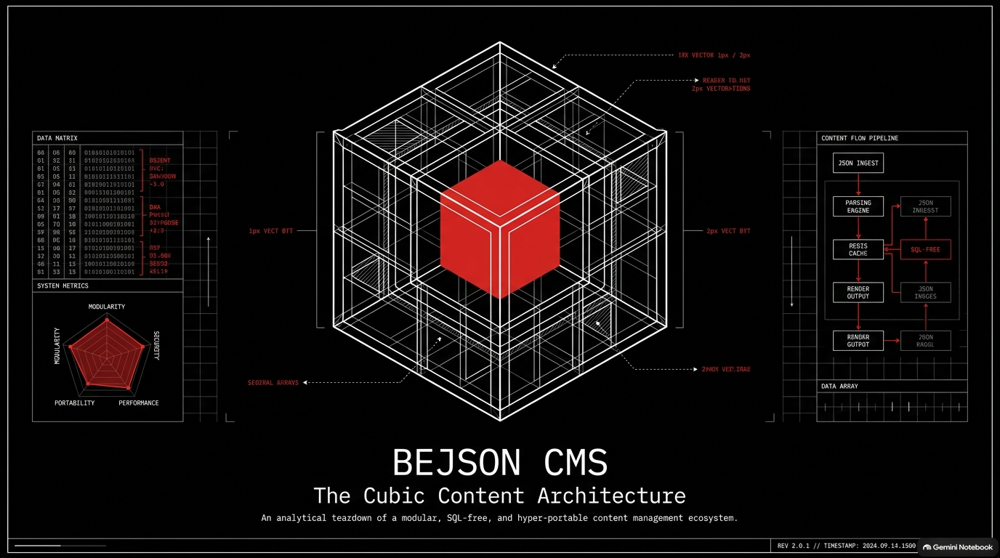
*Figure 1: Architectural & Monolith Overview — Slide 1*

  - [Backup, Disaster Recovery & Live Factory Reset](#backup-disaster-recovery--live-factory-reset)
  - [Static Site Publishing & Cloudflare Pages Deployment](#static-site-publishing--cloudflare-pages-deployment)
- [Technical Details](#technical-details)
  - [System Architecture Topology](#system-architecture-topology)
  - [Directory Structure & Relative Path Architecture](#directory-structure--relative-path-architecture)
  - [BEJSON 104a & 104db Data Standards](#bejson-104a--104db-data-standards)
  - [MFDB Multi-File Database Engine Specifications](#mfdb-multi-file-database-engine-specifications)
  - [Canonical Naming Taxonomy & Entity Schemas](#canonical-naming-taxonomy--entity-schemas)
  - [Data Flow & Core Persistence Lifecycle](#data-flow--core-persistence-lifecycle)
  - [System Security, Boundary Controls & Input Escaping](#system-security-boundary-controls--input-escaping)
  - [Asynchronous Serial Media Worker Architecture](#asynchronous-serial-media-worker-architecture)
  - [Polymorphic Page Renderers & Build Engine](#polymorphic-page-renderers--build-engine)
  - [Automated Verification & Pytest Suite Specifications](#automated-verification--pytest-suite-specifications)
- [Summary](#summary)
  - [Architectural Takeaways & Engineering Design Summary](#architectural-takeaways--engineering-design-summary)
  - [Visual Identity, Branding & CSS Token System](#visual-identity-branding--css-token-system)
  - [Author Credit & Legal Governance](#author-credit--legal-governance)
  - [License Information](#license-information)

---

## Intro and Use Cases

### What is BEJSON_CMS?

**BEJSON_CMS** is a full-featured, modular content management platform and static site generator powered by **Boehnen Elton JSON (BEJSON)** data formats and **Multi-File Database (MFDB)** container technology. Designed to eliminate the overhead, operational complexity, and memory demands of traditional database daemons (such as MySQL, PostgreSQL, or MongoDB), BEJSON_CMS uses local, structured JSON flat-file storage backed by explicit positional integrity schemas and atomic filesystem operations.

The system features a multi-process micro-service architecture comprising five dedicated Flask web services, a headless command-line interface (`cms-manage.py`), an AI Persona Hub (`BEJSON_CMS_ProfileManager.py`), two distinct content authoring suites (`V1` and `V2` Page Editors), an asynchronous media asset processing pipeline, and a static site publishing engine capable of outputting zero-dependency web artifacts ready for host distribution or Cloudflare Pages deployment.

BEJSON_CMS bridges the gap between static site generators (like Hugo or Jekyll) and dynamic web platforms (like WordPress or Ghost). It provides a full administrative GUI, rich media library, category hierarchy, ad unit manager, and AI page generation while retaining the raw speed, portability, security, and low resource overhead of static site builds.

### Core Philosophy & Architectural Directives

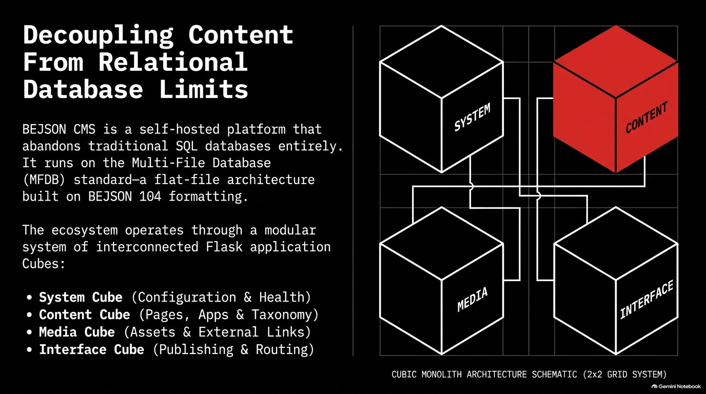
*Figure 2: Architectural & Monolith Overview — Slide 2*


BEJSON_CMS was constructed around five core architectural tenets:

1. **Zero External Database Daemons**: The entire CMS storage layer relies strictly on local JSON files managed by the `CMSCore` unified database abstraction layer (`lib_bejson_CMS_cms_core.py`) and the `MFDB` engine (`lib_bejson_Core_mfdb_core.py`). No SQL database daemons, ORMs, or native C compilation steps are required.
2. **Positional Integrity & Field Map Cache Mandate**: All database queries resolve attributes dynamically through O(1) Field Map Caches (`BEJSONCore.bejson_core_get_field_map()`). Hardcoded field offset indices (such as `row[3]`) are strictly prohibited in application logic. This guarantees backward compatibility and structural safety when new fields are appended to table schemas.
3. **Resilience & Atomic Persistence**: All filesystem writes enforce atomic state transitions using a write-to-temporary-file, flush, and replace sequence (`.tmp` buffer → `fsync()` → `os.replace()`). Multi-process file access is safeguarded by PID lock files (`ResilientPIDLock`), preventing database corruption in the event of unexpected process termination or power loss.
4. **Constrained Hardware Optimization**: Engineered specifically for high performance on resource-constrained platforms, including mobile Android Termux environments and low-power Linux single-board computers (SBCs). Peak memory consumption is strictly bounded using draft decoding, header-only image inspection, and single-worker serial media processing.
5. **Decoupled AI Integration**: Provides deep AI content generation capabilities through customizable system instruction personas (`AI_Profile`), while strictly maintaining boundary separation between internal AI persona instructions and public author display bios on live web pages.

### Primary Use Cases & Real-World Deployments

BEJSON_CMS is designed for a broad spectrum of production web publishing scenarios:

- **Mobile & Offline Content Management**: Running an entire enterprise content management platform directly on an Android smartphone or tablet via Termux or PyDroid3 without requiring an internet connection.
- **Edge Static Site Generation**: Creating, editing, and previewing web content locally, then rendering lightweight, high-speed static HTML/CSS/JS bundles for instant deployment to Cloudflare Pages, Nginx, or GitHub Pages.
- **AI-Augmented Publishing Hubs**: Managing AI writing personas with granular control over domain expertise, creativity settings, and formatting rules to streamline high-volume technical blogging, news syndication, and documentation.
- **Micro-App Directory Hosting**: Packaging and serving standalone web applications (e.g., single-page apps, calculators, interactive widgets) embedded seamlessly into CMS page containers via responsive iframe views.
- **Privacy-First Personal Publishing**: Operating a personal website or technical blog where all raw database content remains stored locally under full user ownership.

### Unorthodox & Specialized Edge Use Cases

Beyond standard web publishing, BEJSON_CMS excels in unorthodox operating environments:

- **Air-Gapped Documentation Vault**: Maintaining secure, version-controlled technical documentation sites on completely disconnected or air-gapped field hardware.
- **Embedded Kiosk Backend**: Serving local interactive web interfaces for industrial, museum, or educational kiosks using simple Python process execution without web server installation.
- **Automated Data Processing Pipeline**: Utilizing the headless CLI tool (`cms-manage.py`) within automated shell scripts and cron jobs to ingest raw HTML documents, cleanse layout structure, and convert them into structured site pages automatically.
- **Portable USB Memory Publishing**: Carrying an entire CMS, raw content database, media assets, and static build outputs on a portable USB drive capable of running on any desktop or mobile system equipped with Python.

### Untapped Potential & Future Engineering Roadmap

The underlying BEJSON 104a and MFDB 131/132 storage layers unlock exciting future expansion vectors:


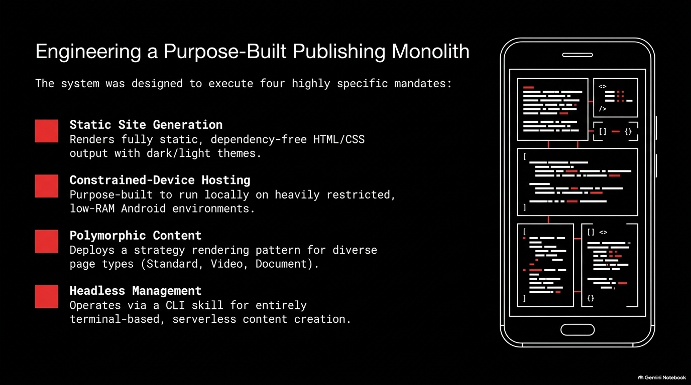
*Figure 3: Architectural & Monolith Overview — Slide 3*

- **Multi-Node Peer-to-Peer Synchronization**: Expanding MFDB container chunking (`lib_mfdb_chunker_v6.py`) to enable seamless peer-to-peer database synchronization across distributed mobile devices without centralized servers.
- **Real-Time Collaborative Editing**: Integrating WebSockets into the V2 API editor (`BEJSON_CMS_PageEditorV2.py`) for concurrent multi-user live editing with Operational Transformation (OT).
- **Multi-Tenant Site Hosting**: Leveraging process-isolated Flask blueprints to host and build multiple independent static web sites from a single master administrative control panel.
- **Automated AI Translation Pipeline**: Expanding persona workflows to automatically translate published pages into multi-lingual static site branches upon build execution.

---

## Usage Guide

### Prerequisites & System Requirements

- **Operating System**: Linux (Ubuntu, Debian, Termux on Android), macOS, or Windows (via WSL or Git Bash).
- **Python Version**: Python 3.10 or higher (Python 3.14 fully tested and supported).
- **Dependencies**:
  - `Flask` (Lightweight web framework for service blueprints)
  - `Pillow` (PIL image processing library for thumbnail generation and WebP conversion)
  - `pytest` (Optional, required for executing automated test suites)

### Installation & Workspace Bootstrap

1. **Clone the Repository**:
   ```bash
   git clone https://github.com/boehnenelton/BEJSON_CMS.git
   cd BEJSON_CMS
   ```

2. **Install Python Dependencies**:
   ```bash
   pip install flask pillow
   ```

3. **Verify Environment Setup**:

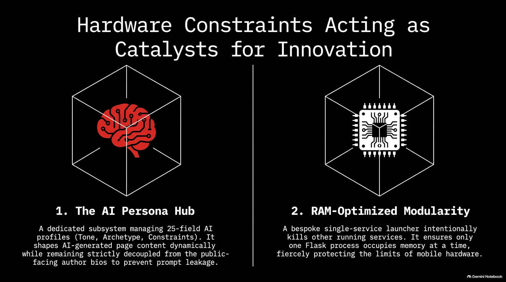
*Figure 4: Architectural & Monolith Overview — Slide 4*

   Check the operational status of the live site manifest and storage directories using the headless CLI toolkit:
   ```bash
   python3 src/cms-manage.py status
   ```

### Service Ecosystem & Multi-Port Execution Map

BEJSON_CMS operates as a micro-service ecosystem consisting of five dedicated web applications assigned to specific port allocations:

| Service Module | Functional Component | Port | Default URL | Primary Responsibility |
|---|---|---|---|---|
| `BEJSON_CMS_Admin.py` | Admin Control Panel | `5001` | `http://localhost:5001` | Main administrative dashboard, site configuration, category CRUD, media gallery, app uploader, and publish trigger. |
| `BEJSON_CMS_PageEditor.py` | V1 Page Editor | `5002` | `http://localhost:5002` | Standalone server-rendered page editor with visual form layout, HTML file uploader, Markdown conversion, and AI planning. |
| `BEJSON_CMS_PageEditorV2.py` | V2 Page Editor | `5005` | `http://localhost:5005` | Modern API-driven page authoring environment with interactive context uploads, real-time media integration, and JSON APIs. |
| `BEJSON_CMS_ProfileManager.py` | AI Persona Hub | `5003` | `http://localhost:5003` | Management suite for 25-field `AI_Profile` persona definitions shaping AI page generation. |
| `BEJSON_CMS_Publisher.py` | Static Publisher | `5004` | `http://localhost:5004` | Static site build generator, rendering engine dispatcher, and deployment status monitor. |

#### Service Launcher Methods

- **Method A: Launch Main Admin Service**:
  ```bash
  python3 src/web/BEJSON_CMS_Admin.py
  ```
- **Method B: Universal Multi-Port Launcher**:
  ```bash
  python3 advanced_launcher.py
  ```
  Launches all five services concurrently in background threads with port verification and automatic browser opening.
- **Method C: Termux Shell Script**:
  ```bash
  ./cms_launcher.sh
  ```

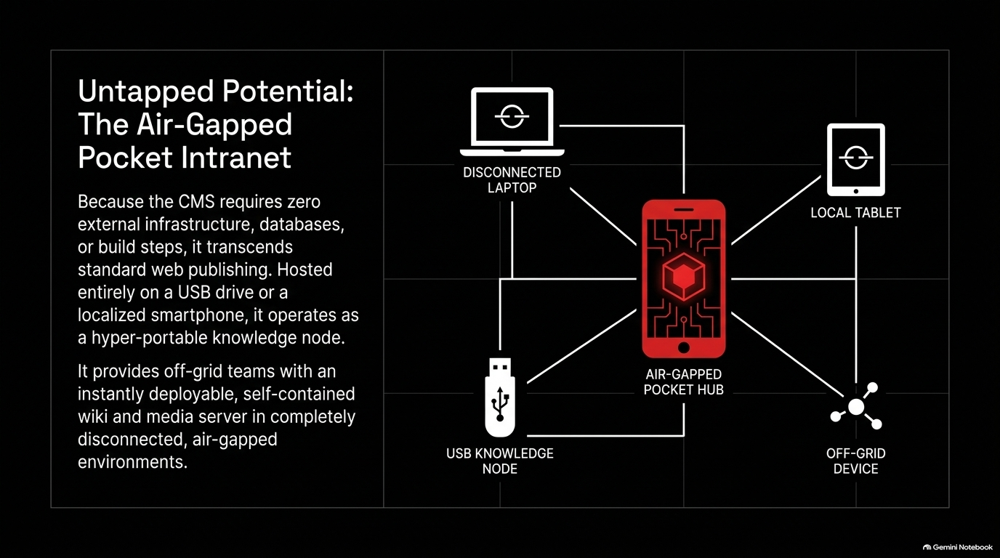
*Figure 5: Architectural & Monolith Overview — Slide 5*

- **Method D: PyDroid3 Android Launcher**:
  ```bash
  python3 pydroid_start.py
  ```

### Admin Web Control Panel (Port 5001)

The Admin Control Panel (`BEJSON_CMS_Admin.py`) serves as the operational center. All admin routes are protected by HTTP Basic Authentication (Default password: `changeme`; configurable via the `CMS_PASSWORD` environment variable).

- **System Dashboard**: Displays real-time counts across all database entities (Pages, Categories, Media Assets, Apps, Nav Links, Social Links, and Ad Units).
- **Global Navigation Bar**: Features top-level navigation links connecting Content management, Media gallery, Interface settings, and System administration.
- **Self-Healing Infrastructure**: Runs automatic self-heal routines (`_ensure_uncategorized_category()` and `_seed_default_brand_and_author()`) on startup, ensuring essential categories and default author profiles survive accidental database resets.

### Content Management & Authoring Workflows

Content in BEJSON_CMS is organized logically into categories, authored by specific display profiles, and rendered dynamically into static HTML.

1. **Managing Categories**: Navigate to `/categories` in the Admin UI or run:
   ```bash
   python3 src/cms-manage.py category add "Technical Tutorials" --slug "tutorials"
   ```
2. **Managing Author Profiles**: Navigate to `/site/authors` or run:
   ```bash
   python3 src/cms-manage.py author add "Elton Boehnen" --bio "Founder & Lead Architect"
   ```
3. **Creating Pages**: Pages can be created via the Admin UI at `/pages/new` or via the CLI:
   ```bash
   python3 src/cms-manage.py page add "Getting Started with BEJSON" --category "tutorials" --author "Elton Boehnen"
   ```

### Standalone Page Editors (V1 & V2)


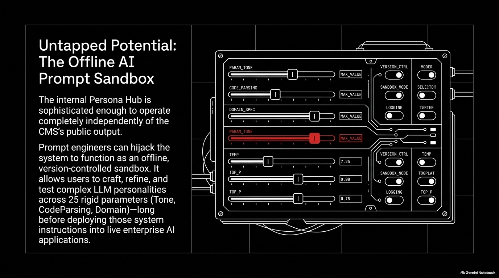
*Figure 6: Architectural & Monolith Overview — Slide 6*

BEJSON_CMS includes two standalone page authoring applications designed for different editorial workflows:

- **V1 Page Editor (`BEJSON_CMS_PageEditor.py`, Port 5002)**: Form-rendered editor supporting direct HTML code file uploads, Markdown file conversion, inline asset selection, and step-by-step AI outline planning.
- **V2 Page Editor (`BEJSON_CMS_PageEditorV2.py`, Port 5005)**: API-driven single-page application built on JSON endpoints (`/api/*`). V2 provides real-time state synchronization, live category creation, inline media asset renaming, context document uploading, and granular task execution.

Both page editors read and write the exact same two-part page persistence contract (`PageRecord` row in manifest + standalone 104db content file at `storage/mfdb/pages_db/<uuid>.json`) and are 100% cross-compatible.

### AI Persona Hub & ProfileManager (Port 5003)

The AI Persona Hub (`BEJSON_CMS_ProfileManager.py`) manages `AI_Profile` records. Each persona configuration controls 25 fields defining system instructions for AI page generation:

- **Identity & Voice**: Name, Archetype, Core Mandate, Tone, Primary Domain, Expertise Level.
- **Style & Formatting**: Code Parsing Languages, Writing Style, Formatting Rules, Structural Layout preferences.
- **Generative Parameters**: Creativity Level, Hallucination Threshold, Context Window bounds.

When creating content in V1 or V2, selecting an author persona injects its system prompt into `lib_cms_persona_writer.py` to guide AI generation while keeping the internal persona description decoupled from public author bios.

### Media Asset Pipeline & Memory-Efficient Processing

The Media Library (`BEJSON_CMS_Media.py`) handles all file uploads, external link media, and thumbnail generation:

- **Asynchronous Upload Queue**: Uploaded files stream directly to disk without loading entirely into memory. An asynchronous serial background worker (`_asset_worker`) processes hashing, SHA-256 deduplication, mime detection, thumbnail generation, and database registration.
- **Low Peak Memory Footprint**: Thumbnail generation uses Pillow's `draft()` mode for JPEG decoding and enforces header-only pixel count caps before decoding image data, eliminating out-of-memory crashes on mobile Android hardware.
- **WebP Image Optimization Tool**: Automatically convert PNG media assets to WebP and update all internal page body references across the content database using the CLI:
  ```bash
  python3 src/cms-manage.py asset optimize
  ```

### Standalone App Bundle Packaging & Embedding

BEJSON_CMS allows hosting full standalone web applications inside page layouts:


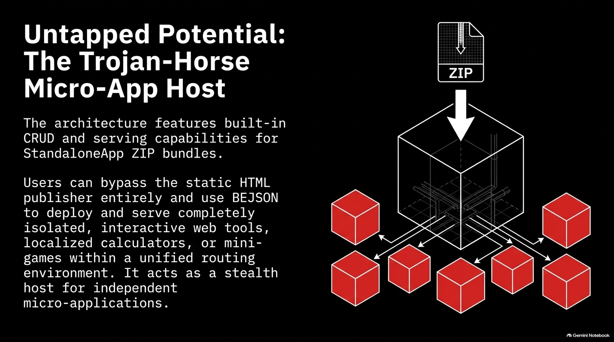
*Figure 7: Architectural & Monolith Overview — Slide 7*

1. **Upload App Bundle**: Upload a ZIP archive containing your web app files (HTML/CSS/JS) via `/apps/new` or the CLI:
   ```bash
   python3 src/cms-manage.py app add "Data Calculator" --entry "index.html"
   ```
2. **ZIP Decompression Protection**: App bundles are extracted using `safe_extract_zip()`, enforcing a 300MB uncompressed size threshold checked directly from the ZIP central directory header.
3. **Responsive Page Embed**: Standalone apps are automatically embedded into native CMS page containers via responsive `<iframe>` elements accessible at `/apps/<slug>/`.

### HTML Batch Import & Conversion Pipeline

Convert legacy HTML articles or documentation exports into native BEJSON pages seamlessly:

1. **Upload HTML Files**: Submit single or batch `.html` files at `/import`.
2. **Preview & Extract**: Inspect extracted page metadata (title, headings, cleaned HTML body).
3. **Confirm & Ingest**: Process items into `PageRecord` database entries and write corresponding 104db content files to `storage/mfdb/pages_db/<uuid>.json`.

### Headless CLI Toolkit (cms-manage.py)

`src/cms-manage.py` provides complete management capabilities without needing a web browser or running Flask servers:

```bash
# Check database status and live manifest mounting
python3 src/cms-manage.py status

# Content Management Commands
python3 src/cms-manage.py page add "New Page" --category "tutorials" --author "Elton Boehnen"
python3 src/cms-manage.py page list
python3 src/cms-manage.py page delete <page_uuid>

# Category & Author Commands
python3 src/cms-manage.py category add "News" --slug "news"
python3 src/cms-manage.py author add "Jane Doe" --bio "Technical Writer"


.png)
*Figure 8: Architectural & Monolith Overview — Slide 8*

# Interface & Banner Ad Commands
python3 src/cms-manage.py nav add "Documentation" --url "/page/tutorials/docs"
python3 src/cms-manage.py social add "GitHub" --url "https://github.com/boehnenelton"
python3 src/cms-manage.py ad add "Top Banner" --img "/assets/banner.png" --link "https://example.com" --zone "header"

# Asset & App Commands
python3 src/cms-manage.py asset add /path/to/image.png
python3 src/cms-manage.py app add "Interactive Widget" --entry "index.html"
```

### Backup, Disaster Recovery & Live Factory Reset

- **Create Live Backup**:
  ```bash
  python3 src/cms-manage.py backup
  ```
  Generates a timestamped ZIP archive in `storage/exports/` containing `site_master`, `pages_db`, `assets`, and `standalone_apps`.

- **Restore Live Data**:
  ```bash
  python3 src/cms-manage.py restore --file storage/exports/BEJSON_CMS_live_backup_20260912_230000.zip
  ```

- **Live Factory Reset**:
  ```bash
  python3 src/cms-manage.py reset
  ```
  Executes a full wipe of live site data after enforcing a mandatory pre-reset safety backup, then self-heals default site configurations and required categories.

### Static Site Publishing & Cloudflare Pages Deployment

Publishing renders the live database into static web assets:

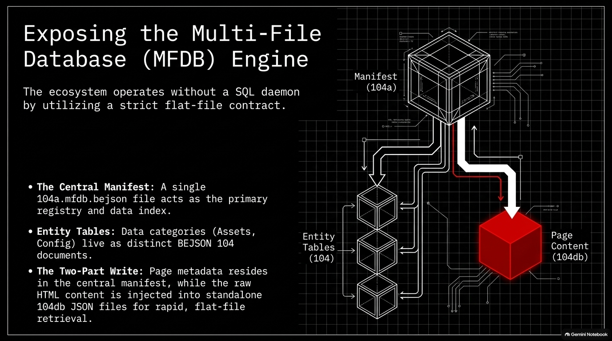
*Figure 9: Architectural & Monolith Overview — Slide 9*


1. **Trigger Publish**: Click **Publish** in the Admin UI or issue an HTTP request:
   ```bash
   curl -X GET http://localhost:5001/publish
   ```
2. **Build Output**: Static HTML pages, category feeds, apps, media assets, and compiled CSS stylesheets are generated inside `storage/builds/`.
3. **Deploy to Cloudflare Pages**:
   ```bash
   npx wrangler pages deploy storage/builds --project-name my-bejson-site
   ```

---

## Technical Details

### System Architecture Topology

```
+-----------------------------------------------------------------------------------+
|                                   BEJSON_CMS                                      |
+-----------------------------------------------------------------------------------+
|                                                                                   |
|  +--------------------+  +--------------------+  +-----------------------------+  |
|  |  Admin Blueprint   |  |   Content Cube     |  |         Media Cube          |  |
|  | (BEJSON_CMS_Admin) |  | (BEJSON_CMS_Cont.) |  |     (BEJSON_CMS_Media)      |  |
|  +---------+----------+  +---------+----------+  +--------------+--------------+  |
|            |                       |                            |                 |
|            +-----------------------+----------------------------+                 |
|                                    |                                              |
|                                    v                                              |
|                    +-------------------------------+                              |
|                    |     CMSCore Database API      |                              |

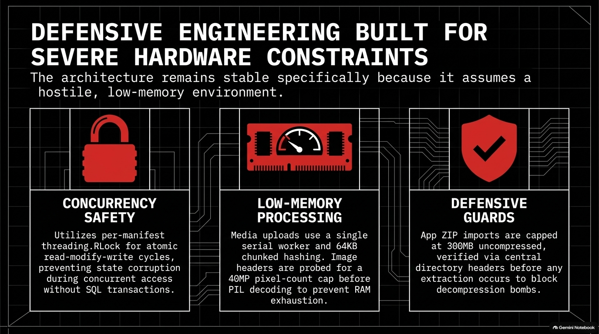
*Figure 10: Architectural & Monolith Overview — Slide 10*

|                    | (lib_bejson_CMS_cms_core.py)  |                              |
|                    +---------------+---------------+                              |
|                                    |                                              |
|                                    v                                              |
|                    +-------------------------------+                              |
|                    |      MFDB Engine Layer        |                              |
|                    | (lib_bejson_Core_mfdb_core.py)|                              |
|                    +---------------+---------------+                              |
|                                    |                                              |
|            +-----------------------+-----------------------+                      |
|            |                                               |                      |
|            v                                               v                      |
|  +---------------------------+               +-----------------------------+      |
|  |   Master Site Manifest    |               |    Page Content Database    |      |
|  | (104a.mfdb.bejson)        |               |   (pages_db/<uuid>.json)    |      |
|  +---------------------------+               +-----------------------------+      |
|                                                                                   |
+-----------------------------------------------------------------------------------+
```

### Directory Structure & Relative Path Architecture

```
BEJSON_CMS/
├── src/
│   ├── cms-manage.py                 # Unified Headless Management CLI Toolkit
│   ├── web/
│   │   ├── BEJSON_CMS_Admin.py       # Admin Flask Entry Point & Auth Blueprint Registrar
│   │   ├── BEJSON_CMS_Shared.py      # Shared Constants, Path Resolution & Renderer Helpers
│   │   ├── BEJSON_CMS_System.py      # System Cube (Dashboard, Config, Factory Reset)
│   │   ├── BEJSON_CMS_Content.py     # Content Cube (Pages, Categories, Apps, Authors)
│   │   ├── BEJSON_CMS_Media.py       # Media Cube (Upload Gallery, Serial Asset Worker)

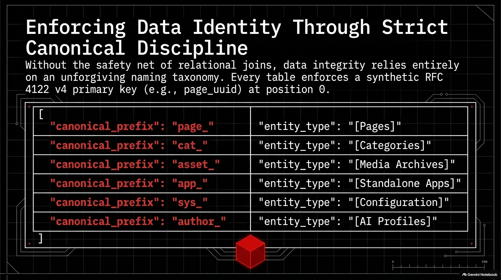
*Figure 11: Architectural & Monolith Overview — Slide 11*

│   │   ├── BEJSON_CMS_Interface.py   # Interface Cube (Nav, Social, Ads, Publish Trigger)
│   │   ├── BEJSON_CMS_PageEditor.py  # V1 Standalone Form Page Editor
│   │   ├── BEJSON_CMS_PageEditorV2.py# V2 Standalone API-Driven Page Editor
│   │   ├── BEJSON_CMS_ProfileManager.py # AI Persona Hub (AI_Profile Management)
│   │   ├── BEJSON_CMS_Publisher.py   # Polymorphic Static Site Publishing Engine
│   │   └── BEJSON_CMS_Renderers.py   # Polymorphic Page Body Rendering Strategies
│   └── lib/
│       ├── lib_bejson_CMS_cms_core.py # CMSCore Unified Application Database API
│       ├── lib_bejson_CMS_taxonomy.py # Canonical Field Prefixes & Schema Definitions
│       ├── lib_bejson_Core_bejson_core.py # Core BEJSON Parser & Field Map Cache Engine
│       ├── lib_bejson_Core_mfdb_core.py   # MFDB Container Engine, PID Locks & Atomic IO
│       ├── lib_bejson_Core_bejson_path_guard.py # Traversal Protection & Safe ZIP Extractor
│       └── lib_cms_persona_writer.py # AI Persona System Prompt Assembly Engine
├── storage/
│   ├── mfdb/
│   │   ├── site_master/              # Site Master Manifest & Entity Flat Files
│   │   │   ├── 104a.mfdb.bejson      # Master Database Container Manifest
│   │   │   └── data/                 # Individual Entity Table Files (.bejson)
│   │   ├── pages_db/                 # Standalone 104db Page Content JSON Files
│   │   ├── assets/                   # Stored Media Files & Generated Thumbnails
│   │   └── standalone_apps/          # Extracted Web Application Bundle Directories
│   ├── builds/                       # Compiled Static Site Artifact Output Directory
│   └── exports/                      # System Safety Backup ZIP Archives
├── resources/
│   ├── templates/                    # Jinja2 HTML Skeleton Templates
│   └── styles/                       # CSS Style Declarations (dark.css & light.css)
├── images/                           # Visual Documentation Diagrams & Architecture Slides
├── tests/                            # Pytest Automated Test Suite Directory
├── .bejson_project.json              # Canonical Project Tracker & Release Metadata
├── cms_launcher.sh                   # Termux Multi-Port Background Launcher
└── advanced_launcher.py              # Universal Python Multi-Port Launcher
```

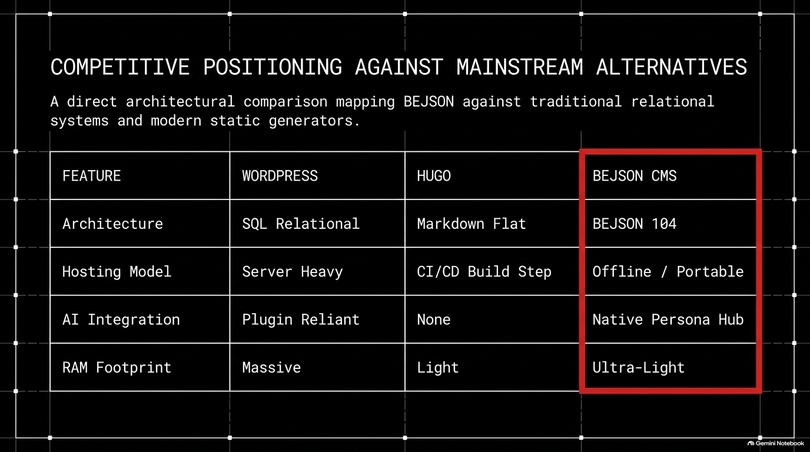
*Figure 12: Architectural & Monolith Overview — Slide 12*


### BEJSON 104a & 104db Data Standards

BEJSON (Boehnen Elton JSON) is a structured flat-file specification designed for deterministic performance and zero positional index ambiguity.

- **BEJSON 104a (Manifest & Entity Master Tables)**: Utilizes top-level structural declarations containing metadata headers (`Format`, `Format_Version`, `Format_Creator`, `Project_Name`), entity field definitions (`Fields`), and ordered values (`Values`).
  ```json
  {
    "Format": "BEJSON",
    "Format_Version": "104a",
    "Format_Creator": "Elton Boehnen",
    "Project_Name": "BEJSON_CMS",
    "Records_Type": ["Category"],
    "Fields": [
      {"name": "cat_uuid", "type": "string"},
      {"name": "cat_name", "type": "string"},
      {"name": "cat_slug", "type": "string"}
    ],
    "Values": [
      ["c1a2b3c4-0000-4000-8000-000000000001", "Tutorials", "tutorials"],
      ["c1a2b3c4-0000-4000-8000-000000000002", "Uncategorized", "uncategorized"]
    ]
  }
  ```

- **BEJSON 104db (Page Content Storage)**: Stores page document content in multi-record format:
  ```json
  {
    "Format": "BEJSON",
    "Format_Version": "104db",
    "Format_Creator": "Elton Boehnen",
    "Records_Type": ["PageMeta", "Content"],

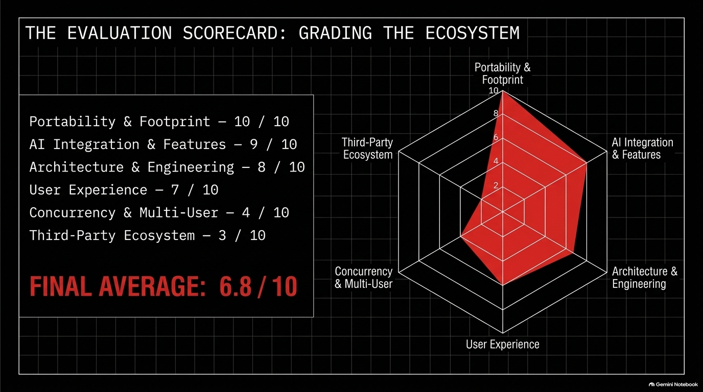
*Figure 13: Architectural & Monolith Overview — Slide 13*

    "Fields": [
      {"name": "Record_Type_Parent", "type": "string"},
      {"name": "meta_title", "type": "string"},
      {"name": "html_body", "type": "string"},
      {"name": "markdown_body", "type": "string"},
      {"name": "source_code", "type": "string"}
    ],
    "Values": [
      ["PageMeta", "Getting Started", null, null, null],
      ["Content", null, "<h2>Welcome</h2><p>Article body text...</p>", "", ""]
    ]
  }
  ```

### MFDB Multi-File Database Engine Specifications

The Multi-File Database (MFDB) engine distributes data storage across atomic JSON container files managed through a single master manifest (`104a.mfdb.bejson`).

- **Field Map Cache Mandate**: Positional indexing (e.g., `row[2]`) is strictly prohibited in application logic. All record operations call `BEJSONCore.bejson_core_get_field_map(doc)`, deriving an O(1) attribute lookup dictionary.
- **Atomic Operations**: All file mutations write to temporary `.tmp` buffers before issuing `fsync()` and performing atomic filesystem replacements (`os.replace()`).

### Canonical Naming Taxonomy & Entity Schemas

Every database entity adheres to a strict canonical prefix convention defined in `src/lib/lib_bejson_CMS_taxonomy.py`:

| Entity Name | Primary Key Column | Required Field Prefixes | Schema Field List |
|---|---|---|---|
| `PageRecord` | `page_uuid` | `page_` | `page_uuid`, `page_title`, `page_slug`, `page_cat_name`, `page_type`, `page_created_at`, `page_external_url`, `page_author_name`, `page_featured_img`, `page_template_key`, `page_featured_video_url` |
| `AuthorProfile` | `author_display_name` | `author_` | `author_display_name`, `author_bio`, `author_avatar_url` |
| `MediaAsset` | `asset_filename` | `asset_` | `asset_filename`, `asset_original_name`, `asset_file_hash`, `asset_file_size`, `asset_mime_type`, `asset_uploaded_at` |
| `ExternalMedia` | `extmedia_uuid` | `extmedia_` | `extmedia_uuid`, `extmedia_name`, `extmedia_type`, `extmedia_url`, `extmedia_created_at` |
| `Category` | `cat_slug` | `cat_` | `cat_name`, `cat_slug` |

.png)
*Figure 14: Architectural & Monolith Overview — Slide 14*

| `AdUnit` | `ad_uuid` | `ad_` | `ad_uuid`, `ad_name`, `ad_banner_url`, `ad_target_url`, `ad_zone`, `ad_active` |
| `NavLink` | `nav_display_label` | `nav_` | `nav_display_label`, `nav_target_url` |
| `SiteConfig` | `sys_key` | `sys_` | `sys_key`, `sys_value` |
| `SocialLink` | `social_platform_name` | `social_` | `social_platform_name`, `social_target_url` |
| `StandaloneApp` | `app_uuid` | `app_` | `app_uuid`, `app_name`, `app_slug`, `app_description`, `app_entry_file`, `app_featured_img` |
| `AI_Profile` | `persona_uuid` | `persona_` | 25-field persona schema controlling identity, expertise, code parsing, and AI generative parameters. |

### Data Flow & Core Persistence Lifecycle

```
   [ Admin Interface / CLI ]
               │
               ▼
   [ CMSCore Unified API ] ──(Field Map Lookup)──► [ O(1) Field Map Cache ]
               │
               ▼
   [ MFDB Engine Layer ]
               │
   ┌───────────┴───────────┐
   ▼                       ▼
[ Master Manifest ]    [ Entity Tables ] ──(Atomic Write)──► [ .tmp Buffer ]
(104a.mfdb.bejson)      (*.bejson)                                │
                                                                  ▼
                                                          [ os.replace() ]
```

### System Security, Boundary Controls & Input Escaping

1. **Path Traversal Guards (`bejson_safe_join()`)**: Prevents relative path manipulation (`../`) by normalizing target paths and verifying parent containment via `Path.is_relative_to()`. Protects against sibling prefix bypasses (e.g., matching `/storage/build_evil` against `/storage/build`).
2. **ZIP Decompression Thresholds (`safe_extract_zip()`)**: Mitigates ZIP bomb attacks by reading uncompressed file sizes directly from the ZIP central directory header prior to extraction, rejecting archives exceeding 300MB.
3. **Basic Authentication**: Global `before_request` auth hook enforces HTTP Basic Authentication across all administrative blueprints.
4. **HTML Escaping & Sanitization**: Dynamic user values in templates are sanitized using `html.escape()` and safe `data-*` attribute bindings.

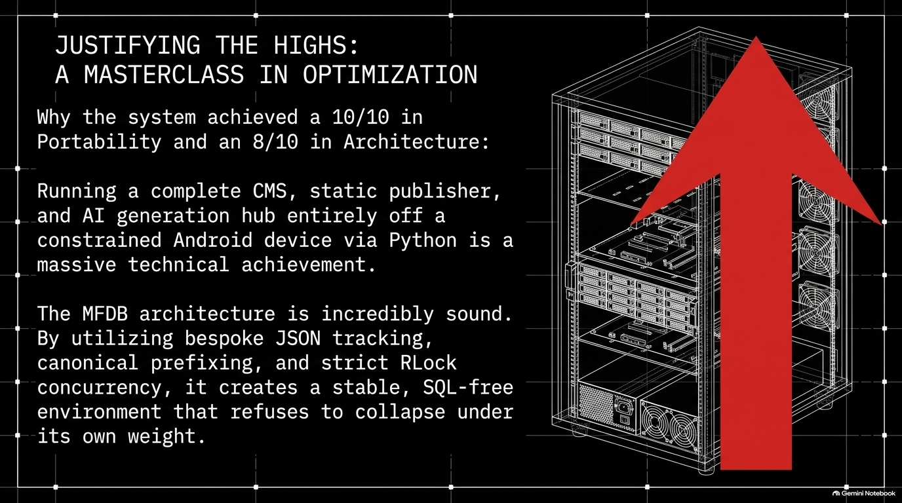
*Figure 15: Architectural & Monolith Overview — Slide 15*


### Asynchronous Serial Media Worker Architecture

To prevent high-resolution image uploads from causing memory exhaustion on mobile hardware:

- **Single Serial Worker (`_asset_worker`)**: Upload requests stream raw bytes directly to disk and enqueue a light job reference. A single background worker processes jobs sequentially, calling `gc.collect()` after each operation.
- **Pillow Draft Decoding**: JPEG thumbnail generation leverages Pillow's low-overhead `draft()` mode to downsample image data during stream decoding.

### Polymorphic Page Renderers & Build Engine

`BEJSON_CMS_Renderers.py` dispatches page body rendering using specialized strategy classes:

- `StandardPageRenderer`: Renders rich text articles, headings, embedded media, and author bio cards.
- `VideoPageRenderer`: Extracts video embeds (YouTube, Vimeo) and renders high-priority video player containers.
- `DocumentPageRenderer`: Formats long-form technical documentation with automatic table-of-contents sidebar navigation.

### Automated Verification & Pytest Suite Specifications

BEJSON_CMS includes 39 automated tests verifying path isolation, authentication hooks, and MFDB database integrity:

```bash
cd tests && python3 -m pytest -v
```

- `test_bejson_cms_admin_auth.py`: Verifies route protection and challenge headers.
- `test_bejson_cms_app_uuid_validation.py`: Tests path traversal prevention on app bundles.
- `test_lib_bejson_CMS_cms_core.py`: Validates CRUD operations and Field Map Cache updates.
- `test_lib_bejson_Core_bejson_path_guard.py`: Enforces path safety boundaries.
- `test_lib_bejson_Core_mfdb_validator.py`: Audits manifest syntax and entity conformance.

---

## Summary

### Architectural Takeaways & Engineering Design Summary

BEJSON_CMS proves that high-performance, resilient, and rich content management platforms can be engineered entirely without heavy database daemons or external web servers. By pairing flat-file BEJSON 104a formats with O(1) Field Map Caching, atomic filesystem guarantees, and modular Flask micro-services, BEJSON_CMS provides a rock-solid publishing engine suitable for mobile Android deployments, desktop environments, and edge publishing.

Key takeaways include:

- **Complete Data Autonomy**: Local flat-file storage eliminates third-party database vendor lock-in.
- **Zero-Dependency Static Exports**: Output files in `storage/builds/` can be deployed anywhere instantly.
- **Extreme Hardware Efficiency**: Low peak memory footprints enable seamless execution on mobile Android devices.
- **Robust Security Architecture**: Path guarding, atomic file IO, and ZIP validation prevent system vulnerabilities.

### Visual Identity, Branding & CSS Token System

The visual design system of BEJSON_CMS enforces a high-contrast, modern aesthetic:

- **Color Palette**:
  - **Background**: Deep Black (`#000000`) and Crisp White (`#FFFFFF`)
  - **Text**: Crisp White (`#FFFFFF`) and Deep Black (`#000000`)
  - **Active / Accent**: Vibrant Red (`#DE2627` / `#DE2626`)
- **Typography & Layout**: Modern REM font scaling, responsive container padding, and clean grid alignment across dark and light themes (`resources/styles/dark.css` and `resources/styles/light.css`).

### Author Credit & Legal Governance

BEJSON_CMS is designed, developed, and maintained by **Elton Boehnen**.

- **Author**: Elton Boehnen
- **Email Contact**: boehnenelton2024@gmail.com
- **Personal Webpage**: [boehnenelton2024.pages.dev](https://boehnenelton2024.pages.dev)
- **GitHub Repository**: [github.com/boehnenelton](https://github.com/boehnenelton)

### License Information

This project is licensed under the **PolyForm Noncommercial License 1.0.0**.

---

.png)
*Figure 16: Architectural & Monolith Overview — Slide 16*
